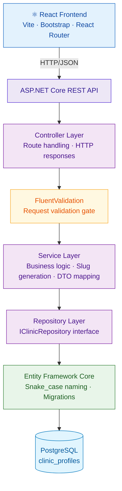

<div align="center">

<br/>

<svg xmlns="http://www.w3.org/2000/svg" width="860" height="180" viewBox="0 0 860 180">
  <defs>
    <linearGradient id="bg" x1="0%" y1="0%" x2="100%" y2="100%">
      <stop offset="0%" style="stop-color:#0D47A1"/>
      <stop offset="100%" style="stop-color:#1565C0"/>
    </linearGradient>
  </defs>
  <rect width="860" height="180" rx="16" fill="url(#bg)"/>
  <rect x="0" y="0" width="860" height="180" rx="16" fill="none" stroke="#1976D2" stroke-width="1" opacity="0.5"/>
  <circle cx="760" cy="40" r="80" fill="#1976D2" opacity="0.3"/>
  <circle cx="100" cy="150" r="60" fill="#0D47A1" opacity="0.4"/>
  <text x="430" y="82" font-family="system-ui, -apple-system, sans-serif" font-size="52" font-weight="700" fill="white" text-anchor="middle" letter-spacing="-1">ClinicEngine</text>
  <text x="430" y="122" font-family="system-ui, -apple-system, sans-serif" font-size="18" font-weight="400" fill="#90CAF9" text-anchor="middle">AI-powered clinic automation · Never miss a call. Never lose a booking.</text>
  <rect x="310" y="140" width="240" height="2" rx="1" fill="#42A5F5" opacity="0.5"/>
</svg>

<br/><br/>


<br/>

**[Overview](#overview) · [Current Status](#current-status) · [Architecture](#architecture) · [API](#api-reference) · [Stack](#technology-stack) · [Run Locally](#running-locally) · [Roadmap](#roadmap)**

</div>

---

## Overview

ClinicEngine is a real-world SaaS product being engineered to solve a specific operational problem: small veterinary clinics routinely lose business through missed calls and manual, error-prone appointment handling.

A receptionist can only handle one call at a time. After hours, calls go unanswered. Appointments get missed, rescheduled incorrectly, or never confirmed. ClinicEngine addresses this with an AI-powered service layer that answers calls, detects caller intent, books appointments, and communicates with clients automatically — while giving clinic owners a centralized dashboard to manage everything.

This repository is also a structured engineering learning project, built to develop and demonstrate production-grade backend engineering, cloud infrastructure, DevOps, and AI systems integration skills through one coherent product — not disconnected tutorial exercises.

---

## Current Status

<table>
<tr>
<td>

**✅ Complete**
- Clinic registration — full vertical slice
- Landing page with feature sections
- Clinic detail page with dynamic routing
- REST API — Clinics module
- PostgreSQL persistence with EF Core
- FluentValidation input gate
- CORS configuration
- React frontend with routing

</td>
<td>

**🔄 In Progress / Planned**
- Authentication module (JWT)
- Booking & scheduling module
- AI call handling (Twilio + NLP)
- Notifications (SMS/email)
- Clinic dashboard
- Billing module
- AWS deployment (Sprint 4)
- Docker containerization (Sprint 5)
- CI/CD pipeline (Sprint 6)

</td>
</tr>
</table>

---

## Working Vertical Slice

The first complete end-to-end feature is implemented and confirmed working.

```
 User visits landing page
          │
          ▼
 Clicks "Get Started"
          │
          ▼
 Fills clinic registration form  ──── React controlled form
          │                           5 fields · useState · handleChange
          ▼
 POST /api/clinics
          │
          ▼
 FluentValidation gate  ──────────── 400 Bad Request if invalid
          │                           field-level error messages returned
          ▼
 Service layer
          │  ├── Generates UUID (id)
          │  ├── Generates slug from name  ("Lone Star Animal Clinic" → "lone-star-animal-clinic")
          │  ├── Sets status = "SETUP"
          │  └── Sets createdAt = DateTime.UtcNow
          ▼
 Entity Framework Core → PostgreSQL
          │                           Row written to clinic_profiles
          ▼
 201 Created + ClinicResponse DTO
          │                           7 safe fields returned (no internal fields)
          ▼
 React programmatic navigation
          │                           navigate(`/clinic/${result.id}`)
          ▼
 /clinic/{id} — detail page
          │
          ▼
 useParams extracts id from URL
          │
          ▼
 GET /api/clinics/{id}
          │
          ▼
 Clinic data displayed  ──────────── name · phone · address · booking link · hours · animals
```

---

## Architecture

ClinicEngine uses a **modular monolith** architecture. One deployable unit, internally structured so each domain module is fully isolated — its own controllers, services, repositories, DTOs, models, interfaces, and validators. Modules never directly access each other's database tables or internal logic.



### Module Anatomy

Every module follows the same internal structure. Consistency is enforced — a developer familiar with the Clinics module immediately knows where to look in any other module.

```
Modules/
  Clinics/
    Controllers/     ← HTTP endpoints, routing, status codes
    DTOs/            ← CreateClinicRequest · ClinicResponse (whitelist pattern)
    Interfaces/      ← IClinicRepository (enables DI and testability)
    Models/          ← ClinicProfile (maps to PostgreSQL table)
    Repositories/    ← ClinicRepository (EF Core implementation)
    Services/        ← ClinicService (business logic, mapping, slug generation)
    Validators/      ← CreateClinicRequestValidator (FluentValidation rules)
```

---

## Project Structure

```
ClinicEngine/
├── ClinicEngine.API/                        ← ASP.NET Core backend
│   ├── Infrastructure/
│   │   └── ClinicEngineDbContext.cs         ← EF Core DbContext
│   ├── Migrations/                          ← EF Core migration history
│   ├── Modules/
│   │   ├── Clinics/                         ← ✅ Implemented
│   │   │   ├── Controllers/ClinicsController.cs
│   │   │   ├── DTOs/CreateClinicRequest.cs
│   │   │   ├── DTOs/ClinicResponse.cs
│   │   │   ├── Interfaces/IClinicRepository.cs
│   │   │   ├── Models/ClinicProfile.cs
│   │   │   ├── Repositories/ClinicRepository.cs
│   │   │   ├── Services/ClinicService.cs
│   │   │   └── Validators/CreateClinicRequestValidator.cs
│   │   ├── Auth/                            ← 🔄 Planned
│   │   ├── Booking/                         ← 🔄 Planned
│   │   ├── AICalls/                         ← 🔄 Planned
│   │   ├── Notifications/                   ← 🔄 Planned
│   │   └── Billing/                         ← 🔄 Planned
│   ├── appsettings.json
│   └── Program.cs
│
├── clinicengine-web/                        ← React + Vite frontend
│   └── src/
│       ├── components/
│       │   ├── NavBar.jsx
│       │   ├── CreateClinicForm.jsx
│       │   ├── FeatureSection.jsx
│       │   ├── HowItWorks.jsx
│       │   └── Footer.jsx
│       ├── pages/
│       │   ├── LandingPage.jsx
│       │   ├── CreateClinicPage.jsx
│       │   └── ClinicDetailPage.jsx
│       └── services/
│           └── clinicService.js             ← All API communication
│
├── .gitignore
└── ClinicEngine.slnx
```

---

## API Reference

### Clinics Module

| Method | Endpoint | Description | Auth |
|--------|----------|-------------|------|
| `POST` | `/api/clinics` | Register a new clinic | None (Auth sprint pending) |
| `GET` | `/api/clinics/{id}` | Fetch clinic by ID | None |

#### `POST /api/clinics`

**Request body**
```json
{
  "name": "Lone Star Animal Clinic",
  "phoneNumber": "+1-713-555-0147",
  "address": "4821 Westheimer Rd, Houston TX 77027",
  "openingHours": "{\"mon\":{\"open\":\"09:00\",\"close\":\"17:00\"}}",
  "animalsSeen": "Dogs, Cats, Rabbits"
}
```

**Success response — `201 Created`**
```json
{
  "id": "155ec031-ae18-4f2d-8a01-05ed07a36979",
  "name": "Lone Star Animal Clinic",
  "phoneNumber": "+1-713-555-0147",
  "address": "4821 Westheimer Rd, Houston TX 77027",
  "slug": "lone-star-animal-clinic",
  "openingHours": "{\"mon\":{\"open\":\"09:00\",\"close\":\"17:00\"}}",
  "animalsSeen": "Dogs, Cats, Rabbits"
}
```

**Validation error — `400 Bad Request`**
```json
{
  "errors": {
    "Name": ["Clinic name is required"],
    "PhoneNumber": ["Phone number required"],
    "Address": ["Address is required"]
  }
}
```

> **Note:** `id`, `slug`, `status`, and `createdAt` are server-generated and never accepted from the client. The booking slug is auto-derived from the clinic name.

---

## Technology Stack

| Layer | Technology | Purpose |
|-------|-----------|---------|
| **Backend** | ASP.NET Core Web API (.NET 10) | REST API framework |
| | C# | Primary backend language |
| | Entity Framework Core | ORM — database access and migrations |
| | Npgsql | PostgreSQL driver for EF Core |
| | FluentValidation | Declarative input validation |
| | EFCore.NamingConventions | Enforces `snake_case` column names |
| **Frontend** | React + Vite | UI framework + build tool |
| | React Router | Client-side routing |
| | Bootstrap 5 | UI styling and layout |
| | JavaScript (ES2022+) | Frontend language |
| **Database** | PostgreSQL | Primary relational database |
| | EF Core Migrations | Schema version control |
| **Config** | dotnet user-secrets | Local secret management |
| | CORS policy | Origin-specific access control |

---

## Key Engineering Decisions

<details>
<summary><strong>UUID primary keys over integer IDs</strong></summary>

All tables use UUID primary keys rather than auto-incrementing integers. Integer IDs are sequential and enumerable — anyone can probe `/api/clinics/4`. UUIDs are generated server-side and are not guessable, removing a trivial attack surface. In C# this is `Guid.NewGuid()`.

</details>

<details>
<summary><strong>Interface-based repository pattern</strong></summary>

Services depend on `IClinicRepository`, not the concrete `ClinicRepository`. This fully decouples business logic from data access. Unit testing service logic requires no database — a mock satisfying the interface is sufficient. When the cloud sprint introduces RDS, the connection string changes in one place and nothing else changes.

</details>

<details>
<summary><strong>DTO whitelist pattern — both directions</strong></summary>

`CreateClinicRequest` defines exactly what the server accepts. A client sending `"status": "LIVE"` or `"businessId": "someone-elses-id"` has those fields silently ignored because they are not on the DTO. This prevents mass assignment attacks structurally — not by runtime checks.

`ClinicResponse` defines exactly what is returned. Internal fields like `businessId` and `status` never leave the server. The whitelist is enforced by type, not by code.

</details>

<details>
<summary><strong>Server-controlled fields</strong></summary>

`id`, `slug`, `status`, `businessId`, and `createdAt` are generated server-side on every creation. The client provides 5 fields. The server builds 10. `status` is hardcoded to `"SETUP"` — no client request can escalate a clinic to `"LIVE"`.

</details>

<details>
<summary><strong>Connection string security</strong></summary>

The connection string lives in `dotnet user-secrets` locally and will live in AWS environment variables in production. `appsettings.json` contains only a placeholder key. Nothing sensitive is committed to source control.

</details>

---

## Engineering Challenges

Real problems encountered and resolved during development:

**CORS origin mismatch** — After configuring CORS in the backend, React requests were still being blocked. Diagnosed by reading the browser console error directly: it showed the exact origin being blocked. Root cause: the CORS policy allowed `localhost:3000` but Vite runs on `localhost:5173`. Fixed by updating the allowed origin to match the actual dev server port.

**EF Core first-migration false alarm** — The initial `dotnet ef database update` logged `fail:` messages before completing successfully. Investigated and confirmed this is expected behaviour — EF Core queries `__EFMigrationsHistory` to check state, that table does not exist on first run, EF creates it and continues. The `Done.` line is the real success signal.

**camelCase JSON serialization boundary** — C# DTOs use `PascalCase` (`PhoneNumber`). ASP.NET Core serializes them to `camelCase` JSON (`phoneNumber`) automatically. React form `name` attributes must use `camelCase` to match the serialized JSON — mismatching this caused the `handleChange` handler to update the wrong state key.

**Programmatic navigation after creation** — After a successful POST, React needed to redirect using the returned resource ID. Used `useNavigate` from React Router to construct `navigate(`/clinic/${result.id}`)` from the API response — not from a Link click.

---

## Screenshots

### Landing Page


### Feature Sections


### Clinic Registration


### Clinic Detail Page


---

## Running Locally

### Prerequisites

- [.NET 10 SDK](https://dotnet.microsoft.com/download)
- [Node.js 18+](https://nodejs.org/)
- [PostgreSQL 15+](https://www.postgresql.org/)
- [dotnet-ef CLI](https://learn.microsoft.com/en-us/ef/core/cli/dotnet): `dotnet tool install --global dotnet-ef`

### 1. Clone

```bash
git clone https://github.com/your-username/ClinicEngine.git
cd ClinicEngine
```

### 2. Configure backend secrets

```bash
cd ClinicEngine.API
dotnet user-secrets init
dotnet user-secrets set "ConnectionStrings:DefaultConnection" \
  "Host=localhost;Port=5432;Database=clinicengine;Username=postgres;Password=YOUR_PASSWORD"
```

### 3. Create database

```bash
dotnet ef database update
```

### 4. Start the API

```bash
dotnet run
# API available at http://localhost:5145
```

### 5. Start the frontend

```bash
cd ../clinicengine-web
npm install
npm run dev
# App available at http://localhost:5173
```

---

## Roadmap

```
Sprint 0   ✅  System design · database schema · architecture planning
Sprint 1   ✅  Clinics module · REST API · PostgreSQL · React frontend · vertical slice
Sprint 2   🔄  Booking module — appointment slots · scheduling logic · availability
Sprint 3   🔄  Auth module — JWT authentication · protected routes · session handling
Sprint 4   🔄  AWS — EC2 · RDS PostgreSQL · Nginx reverse proxy · HTTPS · env config
Sprint 5   🔄  Docker — containerize API and database · Docker Compose
Sprint 6   🔄  CI/CD — GitHub Actions · automated build · test · deploy pipeline
Sprint 7   🔄  AI Calls — Twilio integration · NLP intent detection · call logging
Sprint 8   🔄  Notifications — SMS/email confirmations · reminder scheduling
Sprint 9   🔄  Observability — CloudWatch · structured logging · error tracking
Sprint 10  🔄  Scaling — Redis caching · pgvector · autoscaling · load balancing
```

### Planned Cloud Architecture

```
Local development
      │
      ▼ git push
GitHub repository
      │
      ▼ GitHub Actions CI/CD
Build → test → deploy pipeline
      │
      ▼ on merge to main
AWS EC2 (Linux server)
      ├── ASP.NET Core API
      ├── Nginx + HTTPS (Certbot)
      └── Environment variables
            │
            ▼
AWS RDS (managed PostgreSQL)
            │
            ▼
AWS CloudWatch (logs · metrics · alerts)
```

---

## Author

**Uche** — backend engineering, cloud infrastructure, AI systems integration and Database management
**Leesha** - backend engineering, cloud infrastructure, AI systems integration, and Database management

Built as a real product and engineering portfolio — not a tutorial project or school assignment.

---

<div align="center">

*ClinicEngine is under active development. Architecture, API, and features are evolving sprint by sprint.*

</div>
